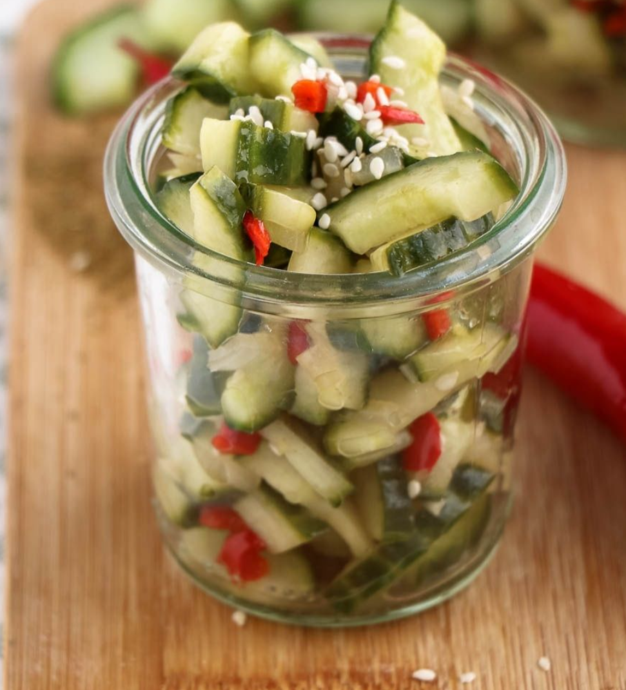

# Atjar Ketimoen

> [Quote]

## Ingredients

- 2 komkommers
- 1 rode peper
- 1 ui (groot)
- 2 teentjes knoflook
- 1 cm verse gember
- 1 theelepel komijn
- 2 theelepels kurkuma
- 1/2 theelepel nootmuskaat
- 4 eetlepels honing
- 125 ml azijn
- 2 eetlepels olie
- sesamzaadjes

## Directions

1. Was de komkommer en snij deze over de lange kant doormidden. Verwijder met een lepeltje de zaadjes, deze gebruiken we niet. Snij de halve komkommers nu nog een keer over de lengte doormidden, zodat je van de komkommer 4 kwarten hebt. Snij in dunne schijfjes.
1.  Schil en snipper de ui, dit mag heel fijn. Snij de peper open, verwijder eventueel de zaadjes als je niet van al te pittig houd, en snij heel fijn. Haal de schil van de gember af en snij in mini blokjes. Maak de knoflook schoon.
1. Verwarm wat olie in de steelpan en fruit hier de ui in aan. Voeg de peper en gember toe, pers de knoflook erbij uit en voeg de komijn, kurkuma en nootmuskaat toe. Blus af met de azijn en schenk de honing erbij. Laat nu 5 minuten zachtjes pruttelen, er ontstaan belletjes en de saus verkleurt iets.
1. Schep de komkommers door het warme azijn mengsel en laat afkoelen. Schep de atjar ketimoen in een glazen pot en bewaar in de koelkast. Of eet gelijk op natuurlijk, maar dan heb je die glazen pot ook niet nodig…. Ik maakte deze Indonesische komkommer salade af met wat sesamzaadjes.

<source: https://www.mindyourfeed.nl/recepten/diner/atjar-ketimoen-indonesische-komkommer/>